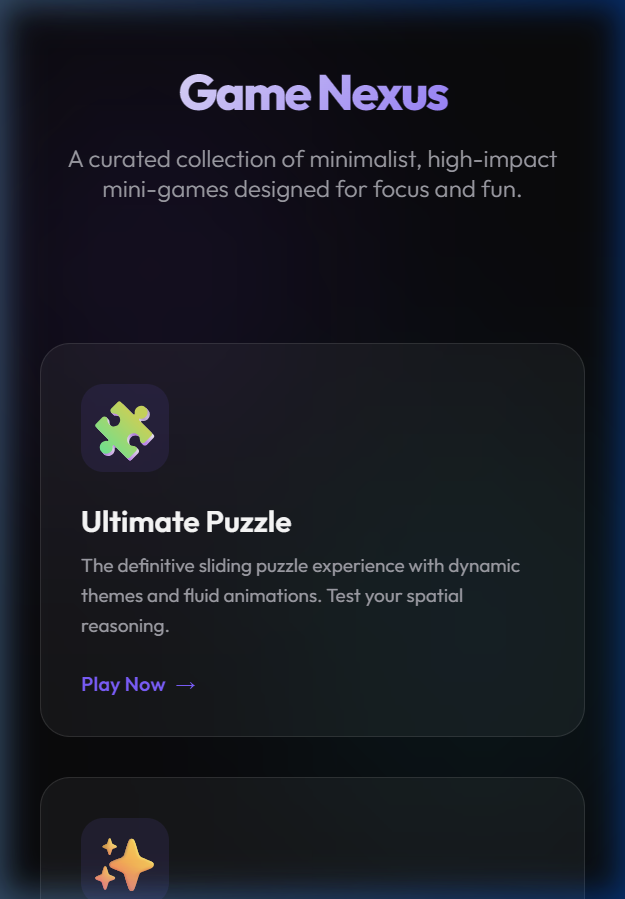
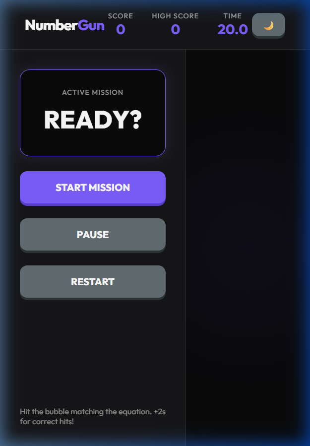
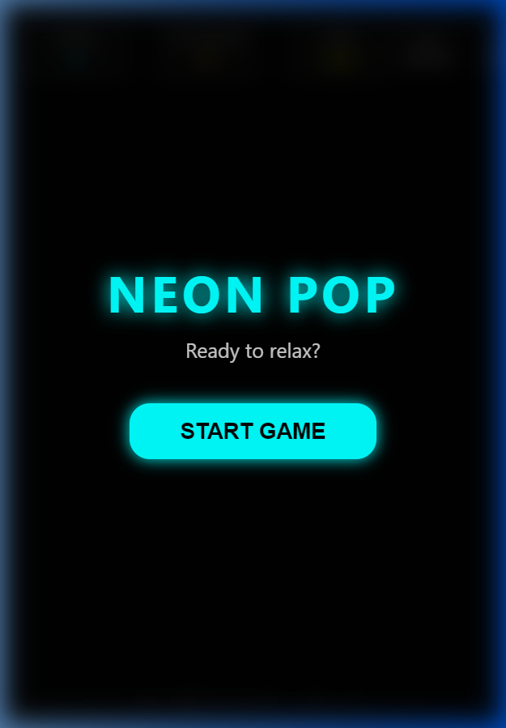
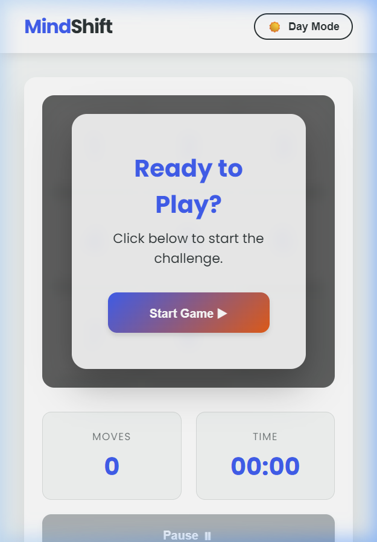
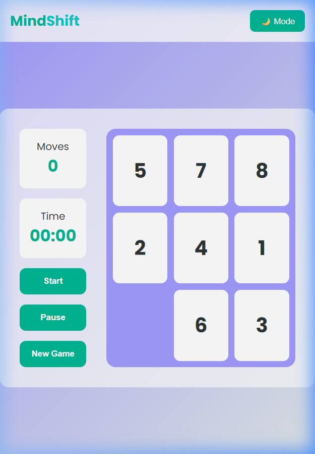

# 🎮 Game Nexus | Premium Mini-Game Collection

<p align="center">
  
  
  
  
</p>

Experience a collection of high-polish, arcade-style mini-games designed with a modern neon aesthetic and interactive glassmorphic interfaces. Built entirely with vanilla web technologies.

---

## 🌟 The Central Hub
The **Game Nexus Hub** is your gateway to all missions. Featuring dynamic hover effects, responsive grid layouts, and a seamless dark mode experience.



---

## 🕹️ Featured Games

### 🎯 Number Gun (Pro Edition)
A fast-paced math shooting challenge that tests your mental arithmetic and precision.
- **🚀 Recent Overhaul**: Complete logic rewrite for integer-only operations.
- **✨ Visual FX**: Custom neon crosshair, particle explosions on hit, and screen shake on miss.
- **⏱️ Skill Rewards**: Earn **+2s time bonuses** for every successful hit.
- **📱 Responsive**: Optimized for all screen sizes with a dedicated control sidebar.



---

### 🌈 Neon Pop
A high-energy reaction test where colors and speed are everything.
- **High-Contrast Design**: Vibrant neon bubbles against a deep dark background.
- **Dynamic Speed**: Difficulty scales as you progress.



---

### 🧩 Ultimate Puzzle
A sophisticated logic game featuring complex board states and a premium glass interface.
- **Brain Training**: Designed to improve spatial reasoning.
- **Interactive UI**: Smooth transitions and satisfying feedback loops.



---

### ⏪ MindShift Classic
The traditional sliding puzzle, reimagined for the modern aesthetic.
- **Custom Themes**: Neon-bathed tiles and sleek animations.
- **Timed Challenges**: Compete against yourself for the best time.



---

## 🛠️ Technical Details

| Feature | Implementation |
| :--- | :--- |
| **Logic** | Pure ES6+ JavaScript (Zero external libraries) |
| **Aesthetics** | Vanilla CSS3 (Custom properties, Blur filters, Keyframes) |
| **Typography** | [Outfit](https://fonts.google.com/specimen/Outfit) via Google Fonts |
| **State** | Enhanced State Management for Pause/Resume/Reset flows |
| **Effects** | Canvas-free Particle Systems and CSS Hardware acceleration |

---

## 🚀 Quick Start

1. **Clone the Repo**
   ```bash
   git clone https://github.com/priyabratasahoo780/Mini_games.git
   ```
2. **Launch**
   Open `main.html` in any modern web browser.
3. **Play**
   Select a game card and start your mission!

---

<p align="center">
  Developed with ❤️ for the Modern Web
</p>
